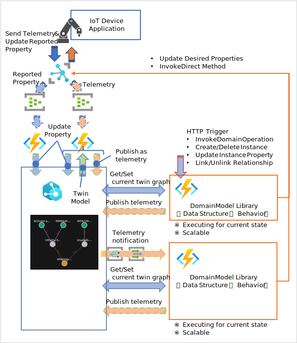
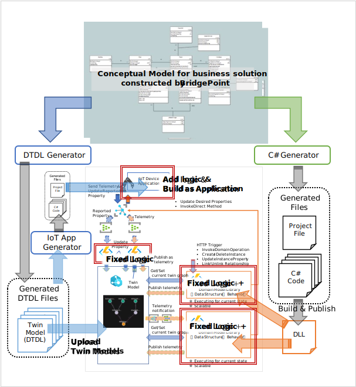
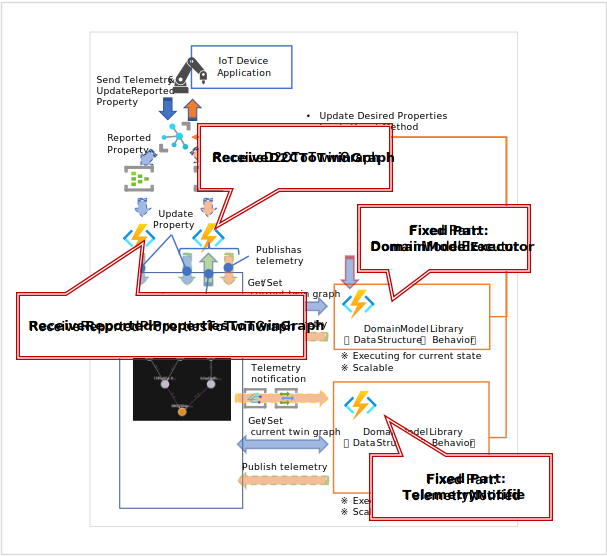

# Tutorial - Generated library from Conceptual Model with Microsoft Azure services

This document describes how to develop <b>Digital Twins & IoT Solution</b> by using <b>Conceptual Modeling</b> for <b>Business scenarios and subject matters</b>. 

The "<b>Conceptual Modeling</b>" is extension of [xtUML](https://xtuml.org/) based modeling techniques for visualizing business, taking into account [my](https://www.linkedin.com/in/hiroshi-ota-009/) [knowledge and experience](https://www.kae-made.jp/).
With the tools and services presented in this document, you can model your business using [BridgePoint](https://github.com/xtuml/bridgepoint), a dedicated conceptual moderling tool, to build not only scalable Digital Twins solution on a cloud but also IoT device application with minimul effort.  
For more information on <b>Conceptual Modeling</b>, please read "[Art of Conceptual Modeling](https://note.com/kae_made/m/m054c9f9f8b61)".

## The big picture of developing solution 
The following services are used to build solution.  
- [Azure IoT Hub](https://learn.microsoft.com/azure/iot-hub/)
- [Azure Digital Twins](https://learn.microsoft.com/azure/digital-twins/)
- [Azure Functions](https://learn.microsoft.com/azure/azure-functions/)
- [Azure Event Hubs](https://learn.microsoft.com/azure/event-hubs/)
- [Azure Event Grid](https://learn.microsoft.com/ja-jp/azure/event-grid/)

The architecture of the solution that can be developed is as follows.  

  

- Secure device connectivity and two-way communication with services using <b>Azure IoT Hub</b>
- Current state of conceptual instances and relationship is hold into <b>Azure Digital Twins</b>, which is very compatible with Conceptual Modeling
- Execute behavior based on business scenario and maintain consistency int conceptual world with a <b>C# code library automatically generated from a Conceptual Model</b> created by <b>BridgePoint</b>.

## Overview of build solution process  
Twin Models described by DTDL and most of the logic of Azure Functions and IoT device application relies on artifacts automatically generated from the <b>Conceptual Model</b>.  
The generated parts are shown as follows.  

  

The generators shown in the figure are published from the following repositories.  
- DTDL Generator - https://github.com/kae-made/dtdl-schema-generator
- C# Generator - https://github.com/kae-made/domainmodel-code-generator-csharp
- IoT App Generator - https://github.com/kae-made/dtdl-iot-app-generator

All generators are also published as NuGet Packages. You can built-in these generator into your DevOps pipeline.  
All Generators are developed using "<b>Implementation by Translation</b>(This techinique is established in Shlaer-Mellor method and xtUML)".  
For more information on "<b>Implementation by Translation</b>", please read "[Technique of Tranfromation](https://note.com/kae_made/m/md806463fb58a)". 

The solution consists of parts that are automatically generated from your conceptual model and fixed code on Azure Functions that don't depend on idividual conceptual models.  

The name of the Azure Functions are as follows.  

All Azure Functions are published from [Github](https://github.com/kae-made/-domain-model-csharp-azure-digital-twins-iot-hub-framework).  
- ReceiveD2CToTwinGraph - [ReceiveD2CToTwinGraph.cs](https://github.com/kae-made/-domain-model-csharp-azure-digital-twins-iot-hub-framework/blob/main/Kae.DomainMode.Csharp.AzureDigitalTwins.AzureIoTHubBinder/ReceiveD2CToTwinGraph.cs)
    - Completely independent formally of indivisual Conceptual Model
- ReceiveReportedPropertiesToTwinGraph - [ReceiveReportedPropertiesToTwinGraph.cs](https://github.com/kae-made/-domain-model-csharp-azure-digital-twins-iot-hub-framework/blob/main/Kae.DomainMode.Csharp.AzureDigitalTwins.AzureIoTHubBinder/ReceiveReportedPropertiesToTwinGraph.cs)
    - Completely independent formally of indivisual Conceptual Model
- DomainModelExecutor - [DomainModelExecutor.cs](https://github.com/kae-made/-domain-model-csharp-azure-digital-twins-iot-hub-framework/blob/main/AzureDigitalTwinsAdaptorForCsharpFramework/DomainModelExecutor.cs)
    - The code itself is formally independent of individual conceptual models.
    - Run with domain model C# code libary automatically genenerated from conceptual model. 
- TelemetryNotified - [TelemetryNotified.cs](https://github.com/kae-made/-domain-model-csharp-azure-digital-twins-iot-hub-framework/blob/main/AzureDigitalTwinsAdaptorForCsharpFramework/TelemetryNotified.cs)
    - The code itself is formally independent of individual conceptual models.
    - Run with domain model C# code libary automatically genenerated from conceptual model. 

---
## Step by Step.  
This section will explain the procedure step by step.  
### 1. Create Conceptual Model for your business  
First of all, building a conceptual model by BridgePoint based on subject matter and scenarios your business works with.  
To learn how to use BridgePoint, please refere to "[ビジネスをモデル化する ～ BridgePoint を使ってみよう](https://note.com/kae_made/n/n26c1d91e686f)".  
I have released training tutorials to build better modes, please refer to "[概念モデリングチュートリアル集](https://note.com/kae_made/m/m737f9295692f)".  

If you have not enought conceptual modeling skill, please use [sample model](./SampleModel/ADTTestModel/gen/code_generation/ADTTestModel.sql).

### 2. Generate Twin Model by DTDL  
Use [DTDL Generator](https://github.com/kae-made/dtdl-schema-generator) to generate Twin Models from Conceptual Model constructed by BridgePoint.  
This generator can generate DTDL file for both Twin Graph on Azure Digital Twins and IoT Plug & Play (IoTPnP) Model from same conceptual model.  
When you write following text on the description of conceptual information class,  
> @iotpnp

The generator generate 2 DTDL files from the conceptual information class. If the name and key letter of the conceptual information class is '<i>Device</i>','<i>D</i>' and specified namespace is '<i>dtmi:com:company</i>', generated files are as follows.  
- <i>Device</i>.json
    - @id - <i>dtmi:com:company</i>:<i>D</i>;1
- <i>Device</i>_iotpnp.json
    - @id - <i>dtmi:com:company</i>:<i>D</i>:iotpnp;1

You can control how property of conceptual information class are generated as DTDL by coloring for the property.  
When you write following text on the description of a property which you'd like to control.
> @iotpnp(deviceid,exclude)

Generator generates DTDL <b>Property</b> only on Twin Graph side because Azure IoT Hub automatically put Device Id into telemetry message from IoT Device to the service side, so the IoT device application doesn't need to send the device id.  

Next, when you write
> @iotpnp(telemetry) 

, Twin Graph side generates as <b>Property</b>, IoT PnP side generates as <b>Telemetry</b>. By this feature, you can realize situation described on https://learn.microsoft.com/azure/digital-twins/how-to-ingest-iot-hub-data .

When you write
> @iotpnp(readonly)  
, The property is generated as <b>Property</b> which's '<b>writable</b>' value is false. On the IoT PnP side, this means that the <b>Property</b> is 'Device Twin Reported Property'.

You can write 'exclude' only,
> @iotpnp(exclude)
The propery is generared as <b>Property</b> only on Twin Graph side.

Command line to generate DTDL is as follows.
> ConsoleAppDTDLGenerator.exe --metamodel <i>BridgePoint</i>\tools\mc\schema\sql\xtumlmc_schema.sql --base-datatype <i>BridgePoint</i>\tools\mc\schema\Globals.xtuml --domainmodel "<i>BridgePoint</i>\workspace\<i>ADTTestModel</i>\gen\code_generation\<i>ADTTestModel</i>.sql" --dtdlns dtmi:com:<i>company</i> --dtdlver <i>1</i> --use-keylett false --gen-folder "<i>WorkingDir</i>\dtdl"

### 3. Generate IoT Device Application from IoT PnP DTDL file.  
By [DTDL IoT App Generator](https://github.com/kae-made/dtdl-iot-app-generator), you can generate IoT Device Application C# code. Generated code has following features which are defined by IoT PnP DTDL file.  
- Connecting to IoT Hub.
    - Use SAS key or X509 certificate
    - Use [Device Provisioning Service](https://learn.microsoft.com/azure/iot-dps/)
- Data structure for telemetry, desired properties and reported properties.
- Send telemetry by repeat at regular intervals or on demand.
- Receive handler for Direct Method invocation, cloud to device message and desired properties updating  

Generated application uses https://github.com/kae-made/azure-iot-hub-device-app-framework as application framework. this framework provides common logic for IoT Device and IoT Edge implementation.

After generared application template, you need to add telemetry data preparetion logic into it.  

Please see https://github.com/kae-made/dtdl-iot-app-generator/blob/main/HowToUse.md to know how to use this generator.  

### 4. Generate Domain Model C# library  
Using https://github.com/kae-made/domainmodel-code-generator-csharp, you can get Domain Model C# library code that consists from data structure and behavior whichi are defined in conceptual model.
Command line to generate code set is
> ConsoleAppCshaprGenerator.exe --metamodel <i>BridgePoint</i>\tools\mc\schema\sql\xtumlmc_schema.sql --base-datatype <i>BridgePoint</i>\tools\mc\schema\Globals.xtuml --domainmodel "<i>BridgePoint</i>\workspace\<i>ADTTestModel</i>\gen\code_generation\<i>ADTTestModel</i>.sql"  --project <i>ADTTestModel</i> --dotnetver net6.0 --gen-folder "<i>gen_folder</i>" --action-gen true  --adoptor-gen true --azuredigitaltwins dtmi:com:<i>company</i>;1  --azure-iot-hub true

Before generating, you'd better verify your conceptual model using BridgePoint's verifier. It is impossible to generate valid code from a model that does not correctly represent the real business world.  
Generated code can be executed by https://github.com/kae-made/domain-model-csharp-adaptor-samples and should be verified not only by BridgePoint Verifier but also by this tool.  
For your information, you can also use https://github.com/kae-made/domain-model-csharp-adaptor-samples/tree/main/UIDomainAdaptorSamples/WebAPIAppViewer published from same repository to deploy as Web Application.   

Generated code uses https://github.com/kae-made/state-machine-framework and https://github.com/kae-made/charp-code-generation-framework as application framework.  

### 5. Upload generated Twin Models  
Upload the DTDL files generated in Step 2. to the Azure Digital Twins instance. You can use [Azure Digital Twins Explorer](https://learn.microsoft.com/azure/digital-twins/how-to-use-azure-digital-twins-explorer) or [WpfAppDTDLParser](https://github.com/kae-made/magazine-iot-contents/tree/main/sources-service-on-device/WpfAppDTDLParser).  

### 6. Construct initial Twin Graph  
Construct initial Twin Graph by [Azure Digital Twins Explorer](https://learn.microsoft.com/azure/digital-twins/how-to-use-azure-digital-twins-explorer) or [WpfAppATDOperation](https://github.com/kae-made/magazine-iot-contents/tree/main/sources-service-on-device/WpfAppADTOperation).  
It is very difficult to operate Twin Graph to maintain the constraints of property values and relationships defined in the conceptual model that it is recommended to construct Twin Graph state with the latter too or execute the generated Domain Model C# library.  

### 7. Deploy and Setting Azure Services.  
Please refer Microsoft Docs contents or "[Azure の最新機能で IoT を改めてやってみる](https://note.com/kae_made/m/m5f5f32fee80b)" for following work...

- Deploy IoT Hub.
    - Create message route for d2c message
    - Create message route for device twins update
- Clone https://github.com/kae-made/-domain-model-csharp-azure-digital-twins-iot-hub-framework
- Open [AzureDigitalTwinsAdaptorForCsharpFramework.sln](https://github.com/kae-made/-domain-model-csharp-azure-digital-twins-iot-hub-framework/blob/main/AzureDigitalTwinsAdaptorForCsharpFramework.sln)
    - Deploy [AzureIoTHubBinder project](https://github.com/kae-made/-domain-model-csharp-azure-digital-twins-iot-hub-framework/blob/main/Kae.DomainMode.Csharp.AzureDigitalTwins.AzureIoTHubBinder/Kae.DomainMode.Csharp.AzureDigitalTwins.AzureIoTHubBinder.csproj)
    - Configure ReceiveD2CToTwinGraph
        - Bind to d2c message route.
        - This function operates Twin Graph so access permissions to Twin Graph must be granted
    - Configure ReceiveReportedPropertiesToTwinGraph
        - Bind to device twins update message route
        - This function operates Twin Graph so access permissions to Twin Graph must be granted
    - Build/Deploy DomainModelExecutor, TelemetryNotified and Web Application frontend
        - Open AzureDigitalTwinsAdaptorForCsharpFramework.sln
        - Add generated Domain Model C# library project as project reference to the [AzureDigitalTwinsAdaptorForCsharpFramework project](https://github.com/kae-made/-domain-model-csharp-azure-digital-twins-iot-hub-framework/blob/main/AzureDigitalTwinsAdaptorForCsharpFramework/Kae.DomainModel.CSharp.Utility.Application.AzureDigitalTwinsFunction.csproj).
        - Deploy [AzureDigitalTwinsAdaptorForCsharpFramework project](https://github.com/kae-made/-domain-model-csharp-azure-digital-twins-iot-hub-framework/blob/main/AzureDigitalTwinsAdaptorForCsharpFramework/Kae.DomainModel.CSharp.Utility.Application.AzureDigitalTwinsFunction.csproj).
        - Add generated Domain Model C# library project as project reference to the [WebAPIAppViewerForADT project](https://github.com/kae-made/-domain-model-csharp-azure-digital-twins-iot-hub-framework/blob/main/WebAPIAppViewerForADT/Kae.DomainModel.CSharp.Utility.Application.WebAPIAppDomainModelViewerForADT.csproj).
        - Deploy [WebAPIAppViewerForADT project](https://github.com/kae-made/-domain-model-csharp-azure-digital-twins-iot-hub-framework/blob/main/WebAPIAppViewerForADT/Kae.DomainModel.CSharp.Utility.Application.WebAPIAppDomainModelViewerForADT.csproj).
    - Configure access mode of Azure Digital Twins for both deployed projects.
    - Deploy TimerService for Domain Model's delay events
        - Deploy [AzureDigitalTwins.Timer project](https://github.com/kae-made/-domain-model-csharp-azure-digital-twins-iot-hub-framework/blob/main/Kae.DomainModel.Csharp.AzureDigitalTwins.Timer/Kae.DomainModel.Csharp.AzureDigitalTwins.Timer.csproj).
        - Configure access mode of Azure Digital Twins for the project.

